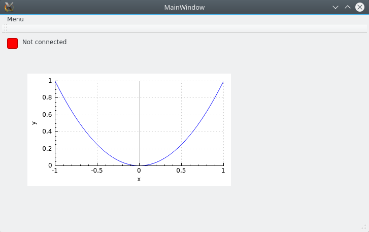

# Plot graphics with qtcustomplot

In this tutorial, we will show how to plot a simple graph with qtcustomplot in qtcrator (french version).

First copy past the qcustomplot.h and qcustomplot.cpp files into the folder of the project and add these files to the project in qtcreator.

In the graphic interface (file.ui) add a widget (in containers list). Then right click on it and select "promouvoir en", in "nom de la classe promue" type **QCustomPlot**, put (or not) the capital as you want so that the "fichier d'en-tête" is **qcustomplot.h**.

Now one can had of class-function in the MainWindow(.cpp and .h) files like plot() like (from qcustomplot examples):

    void MainWindow::plot()
    {
    // generate some data:
    QVector<double> x(101), y(101); // initialize with entries 0..100
    for (int i=0; i<101; ++i)
    {
      x[i] = i/50.0 - 1; // x goes from -1 to 1
      y[i] = x[i]*x[i]; // let's plot a quadratic function
    }
    // create graph and assign data to it:
    ui->customPlot->addGraph();
    ui->customPlot->graph(0)->setData(x, y, true); //set true if sure x is sorting ascending
    // give the axes some labels:
    ui->customPlot->xAxis->setLabel("x");
    ui->customPlot->yAxis->setLabel("y");
    // set axes ranges, so we see all data:
    ui->customPlot->xAxis->setRange(-1, 1);
    ui->customPlot->yAxis->setRange(0, 1);
    ui->customPlot->replot();}

the x and y data must be of class QVector<double>.

We obtain that graphic:

