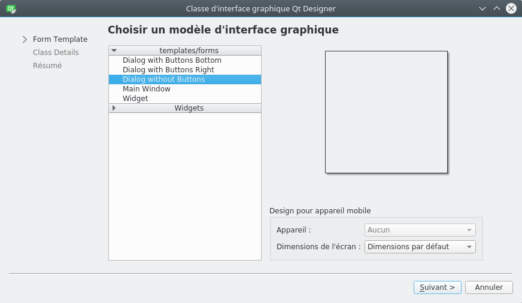
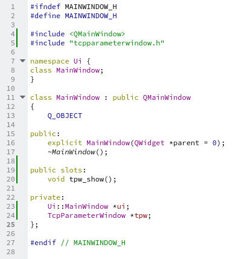
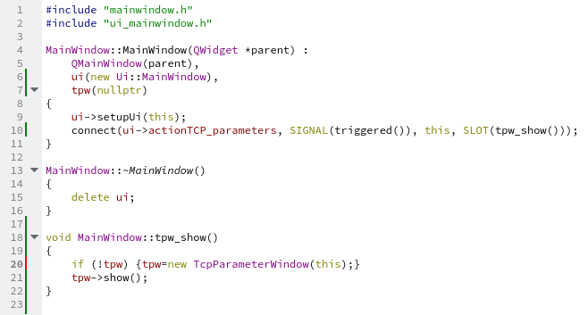

# How to create and show a new interface using qtcreator

If one wants to create a new interface (new window) in qtcreator first go to (french version):

Fichier->Nouveau fichier->Qt->Classe d'interface graphique Qt Designer

Choose one of the Dialog method, let named that class **TcpParamaterWindow**.

In mainwindow.h add the line:

    include "tcpparameterwindow.h"

and add a private class object TcpParameterWindow:

here a 

    public slots:
    void tpw_show();

has been added. This function is declared as a slot so we can show the new window after an given even using the signal/slot methode.

In mainwindow.cpp the constructor of the class must be modified by adding the defaut class tcpparameterwindow pointor (here as a null pointor) -> tpw(nullptr):

The signal/slot methode is implemented in the constructor with the connect(,,,) function. Here we have choosen to show the new window when cliquing on a menu action.

    